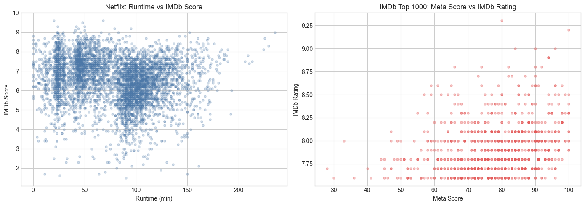
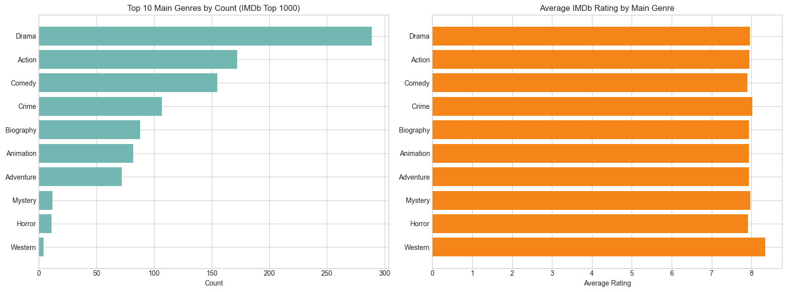

# Project of Data Visualization (COM-480)

| Student's name | SCIPER |
| -------------- | ------ |
|Yassine Alaoui | 358113 |
|Amine Louah | 343896 |
|Sarah Lim | 341929 |
|Ilian Changkakoti | 340815 |

[Milestone 1](#milestone-1) • [Milestone 2](#milestone-2) • [Milestone 3](#milestone-3)

## Milestone 1 (20th March, 5pm)

**10% of the final grade**

### Dataset

We use two publicly available datasets from Kaggle: the **IMDb Top 1000 Movies**
dataset and a **Netflix Movies and TV Shows** IMDb scores dataset.
Together, they provide a more complete dataset that allows us to draw comparisons between a curated list of top-rated films and the broader more varied catalog of a big streaming platform.

#### IMDb Dataset

The IMDb dataset (~1,000 entries) includes ratings, vote counts, genres,
directors, metascores, and gross revenue. It is well-structured but requires light
preprocessing - mainly standardizing runtime formats, parsing numerical columns
(e.g., removing commas from gross revenue), and handling sparse metascore and
revenue fields.

#### Netflix Dataset

The Netflix dataset (~5,000 entries) covers both movies and TV shows with
wider rating variability and more missing values (e.g., age certification). It
requires filtering to movies only and additional cleaning to align with the IMDb
dataset's format.

Dataset Complementarity

Both datasets are suitable for visualization with moderate preprocessing effort.
Their complementary nature one curated, one broad gives us direct exploration
of differences in quality perception of movies.

### Problematic

This project examines how movie ratings reflect quality, popularity, and platform
context and where rating systems disagree. Rather than reproducing rankings,
we focus on contrasts :
- Do highly rated movies attract more votes, or is popularity really independent of quality?
- Where do audience ratings (IMDb) and critic scores (Metascore) diverge most?
- How do ratings shift across genres and release decades?
- How does Netflix content compare to IMDb's curated top tier?

These questions are inherently visual: distributions, temporal trends, and rating
gaps are a lot harder to grasp from summary tables than from charts.
The target audience is anyone curious about how movies are evaluated online. The
interface will support interactive filtering by genre, year, and content type,
allowing users to explore patterns on their own, especially since there is a big debate on whether Marvel Movies (that are pretty famous) are inherently good.

### Exploratory Data Analysis

#### Preprocessing

Numerical fields (ratings, votes, metascore, year) were standardized. Runtime was
extracted from raw text, and comma-formatted numbers were cleaned. Missing values
were dropped rather than imputed, as the goal at this stage is broad exploration,
not predictive modeling.

Key Statistics

*Figure 1: Comparison of Metascore and movie duration against IMDb scores to identify rating discrepancies.*

- **IMDb Top 1000** - ratings tightly clustered
          (mean $\approx 7.95$, SD $\approx 0.28$), reflecting the dataset's
          curated nature. Missing data mainly affects metascore and gross revenue.
- **Netflix** - much wider spread
          (mean $\approx 6.53$, SD $\approx 1.16$), with a peak around
          $6.5$ - $7.0$, indicating far greater content variability.

#### Emerging Patterns

- IMDb ratings concentrate between $7.5$ and $8.5$; Netflix ratings are more dispersed.
- Drama dominates both datasets, followed by Comedy, Crime, and Action.
- The correlation between vote count and rating is positive but weak ($\approx 0.19$) - popularity alone does not predict quality.
- IMDb ratings trend slightly downward in recent decades; Netflix ratings remain relatively stable over time.

These differences in distribution, genre mix, and temporal behavior confirm that
the datasets are analytically complementary and visually rich.

### Related work

IMDb data is frequently used in data science projects  for ranking top films,
analyzing genre trends, or training rating prediction models. Most of these
analyses rely on bar charts or scatter plots and focus on averages rather than
disagreements.

Our approach differs by centering on discrepancies: gaps between critic
and audience scores, outliers where popularity and quality diverge, and
distributional differences between platforms. We draw inspiration from data
journalism outlets like *FiveThirtyEight* and *The Pudding*, which
prioritize clear comparisons over raw statistics, and also videos that were ranking movies on Youtube (ex : *Stats over Time*)

#### Planned Visual Techniques

- **Audience vs Critic plots**   To capture the "fans vs. critics" debate, we’ll use dumbbell plots. Instead of a single data point, every movie gets a line connecting two dots: the regular IMDb user score and the Metascore (Critics). By sorting these by the widest gaps, we can surface the most divisive movies in the dataset and see exactly where general audiences and critics completely differ.

- **Interactive Genre Bar Chart Race**   This visualization has a dynamic timeline slider that allows users to navigate smoothly from the 1920s to the present. As the timeline progresses, the chart continuously reorders the genres in real-time to reflect their shifting prevalence. This dynamic approach could illustrate major historical transitions such as the dominance of Westerns being eclipsed by Action and Sci-Fi later.
    
- **Contour Density Maps**   To track how content quality evolves by decade : Standard scatter plots for tracking "Popularity (Vote Count) vs. Quality (Rating)" often suffer from overplotting. Instead, we will use  density mapping. This will group movies into hexagonal bins colored by data density, allowing us to see where the vast majority of films actually sit, and clearly isolate the outliers (like highly-rated hidden gems).

## Milestone 2 (17th April, 5pm)

**10% of the final grade**

## Milestone 3 (29th May, 5pm)

**80% of the final grade**

## Late policy

- < 24h: 80% of the grade for the milestone
- < 48h: 70% of the grade for the milestone

